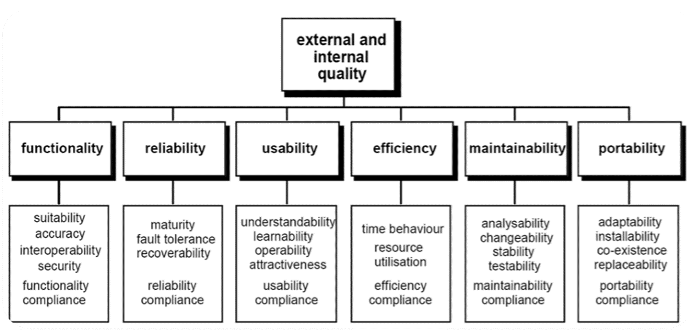

# Lecture 8

📝 **Principles of GUIs**

Principles of GUIs help create effective designs for user interfaces.

👤 **Users/Customers Won't Tell You If You Don't Have It!**

Users won't express their needs if certain principles are missing.

📊 **Guidelines for GUI Design**

1. 🗂️ **Organization and Structure:**
   * Prioritize organizing information.
   * Understand user tasks and frequently sought data.
2. 🧭 **Navigation:**
   * Decide on navigation and structure first.
   * Then focus on format, content, and appearance.
3. 🖼️ **Format, Content, and Appearance:**
   * Content and navigation should go hand in hand.
4. 🧼 **Housekeeping:**
   * Maintain both the application interface/site and individual pages.

🏗️ **Organization and Structure**

1. 🧩 **Make Important Information Easy to Find:**
   * Identify crucial user tasks.
   * Highlight frequently needed information.
2. 🚫 **Avoid Mental Model Assumptions:**
   * Users often don't form a mental model of sites.
   * They tend to keep moving forward rather than backing out.
3. 🔄 **Returning to the Home Page:**
   * Users frequently return to the home page.
   * Even if a needed link is on the page they were on.
4. 📏 **Fitting on a Single Screen:**
   * Organize information to fit on one screen.
5. ⏩ **Speed of Information Presentation:**
   * Design for fast information presentation.
   * Slow downloads are a common user complaint.
6. 📱 **Platform and Resolution Independence:**
   * Ensure compatibility across different platforms and resolutions.
7. 🖼️ **Use Frames with Caution:**
   * Frames can be disorienting and necessitate extra scrolling.

🧭 **Navigation**

1. ❓ **Two Key Questions:**
   * "Where am I?"
   * "How do I get to X?"
2. 🌍 **Local and Global Navigation:**
   * Keep navigation simple.
   * Follow a hierarchical organization.
3. 🗺️ **Site Map for Larger Sites:**
   * Ensure users can always determine their current location.
4. 🔍 **Navigation - Search:**
   * Have a good search feature.
   * About one third of users rely on site search initially.
5. 🧰 **Design for Search Results:**
   * Help users browse search results with "Previous" and "Next" buttons.
   * Assist users in choosing from among the results.
6. 🌐 **Consistent Navigation Options:**
   * Keep navigation options consistent throughout the site.
   * Ensure they remain visible and easily accessible.
7. ⏩ **Shortcuts for Task Paths:**
   * Provide shortcuts for the most likely task paths.
   * Avoid horizontal scrolling and minimize vertical scrolling.
8. 🔗 **Use of Links:**
   * Use links liberally but appropriately.
   * Ensure meaningful and precise link content.
9. 🚫 **Avoid Ambiguous Link Wording:**
   * Discourage the use of vague link terms like "click here" or "here."
   * Use descriptive and clear link wording.
10. 🎯 **Link Predictiveness and Distinguishability:**
    * Be clear about where the link will take the user.
    * Ensure each link is distinguishable from others.
11. 🖇️ **Text Link Layout and Consistency:**
    * Ensure consistent style and layout of text links.
    * Avoid layout elements that interfere with scanning.
12. 🖼️ **Image (Graphical) Links:**
    * Use graphical links cautiously and ensure they appear selectable.
    * Maintain consistency in design and functionality.
13. 🔗 **Link Destination Consistency:**
    * Maintain consistency in link destinations within the site.
    * Avoid dead-end pages by utilizing the power of hypermedia.

🎨 **Format, Content, & Appearance**

1. 🖥️ **Multimedia vs. Hypermedia:**
   * Don't just translate existing printed material into hypermedia.
   * Avoid overusing graphics, animations, and other distractions.
2. 🌟 **Graphics and Site Enhancement:**
   * Graphic design doesn't automatically make a site better.
   * Graphics alone don't necessarily make sites more interesting.
3. 🚀 **Information Seeking vs. Surfing:**
   * Animation and distractions can hurt user performance.
   * Cool stuff attracts surfers but can distract users.
4. 📚 **Content and Readability:**
   * Content and descriptive links drive information seeking.
   * Maximizing readability through fonts, color, and layout is essential.
5. 📜 **Maximizing Readability:**
   * Use bullets and concise language for easy scanning.
   * Optimize white space for effective organization.
6. ✒️ **Font Usage and Readability:**
   * Use a small number of legible and distinct fonts.
   * Avoid excessive use of all-caps, italics, and underlining.
7. 🎨 **Color Usage and Semantics:**
   * Use color consistently and semantically throughout the pages.
   * Remember that many people are color blind.
8. 📐 **Layout and Design:**
   * Choose a theme for layout organization, with emphasis on key parts of the page.
   * Keep the layout simple and visually appealing.
9. 🖼️ **Background Image and Selectable Items:**
   * Keep the background image simple and non-distracting.
   * Ensure that selectable items are easily recognizable.
10. 🔍 **Quality Assurance:**
    * Conduct thorough usability evaluations before each release.
    * Perform monthly checks for broken links and outdated information.

🏠 **Housekeeping**

1. 🧪 **Thorough Usability Evaluation:**
   * Evaluate technical quality, structure, navigation, and readability before each release.
2. 🌐 **Testing Across Various Platforms:**
   * Test the site with numerous browsers, different platforms, and varied connection speeds.
   * View the site with images turned off and on different monitor sizes and resolutions.
   * Test the site at the expected peak usage time.
3. 🕸️ **Cobweb Search and Maintenance:**
   * Conduct a regular cobweb search to avoid link rot and identify broken or stale links.
4. 🔄 **Regular Updates:**
   * Update the site at least monthly to remove outdated or incorrect information.
5. 📞 **Contact Information:**
   * Ensure that contact information, such as that for the webmaster, is prominently displayed, preferably on the home page.

Adhering to these housekeeping practices is crucial for maintaining a high standard of website usability and functionality! 🏠🔍🔧

_<mark style="color:blue;">**Web Usability**</mark>_&#x20;

_**ISO/IEC 9126-1 Software Quality Model**_\

<figure><figcaption></figcaption></figure>

_**Usability**_

