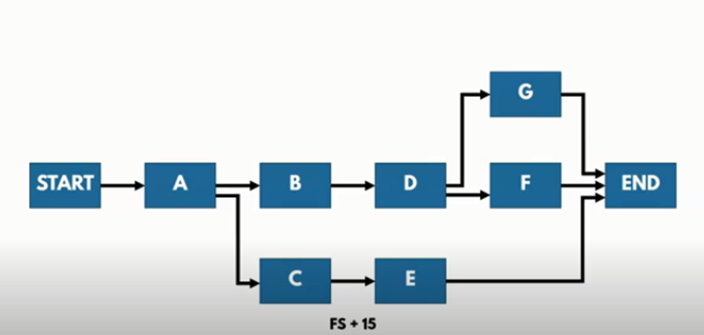

# Lecture 5

📅 **Project Schedules and Time Management:**

* Understand the importance of project schedules and good project time management.
* Discuss the process of planning schedule management.
* Define activities as the basis for developing project schedules.
* Describe how project managers use network diagrams and dependencies to assist in activity sequencing.
* Understand the relationship between estimating resources and project schedules.
* Explain how various tools and techniques help project managers perform activity duration estimates.

📆 **Schedule Planning and Tracking:**

* Use a Gantt chart for planning and tracking schedule information, find the critical path for a project.
* Describe how critical chain scheduling and the Program Evaluation and Review Technique (PERT) affect schedule development.
* Understand how time management is addressed using Agile.
* Discuss how reality checks and discipline are involved in controlling and managing changes to the project schedule.
* Describe how project management software can assist in project time management and review words of caution before using this software.

🕒 **Challenges in Project Time Management:**

* Managers often cite delivering projects on time as one of their biggest challenges.
* Time has the least amount of flexibility; it passes no matter what happens on a project.
* Schedule issues are the main reason for conflicts on projects, especially during the second half of projects.

🌍 **Cultural Considerations:**

* Some people prefer to follow schedules and meet deadlines while others do not.
* Different cultures and even entire countries have different attitudes about schedules.
* Cultures may also have different perceptions of work ethic; some may value hard work and strict schedules while others may value the ability to remain relaxed and flexible.

⏰ **Project Time Management:**

* With all these possibilities for schedule conflicts, it is important to use good project time management so that project managers can help improve performance in this area.
* Project time management, simply defined, involves the processes required to ensure timely completion of a project.
* Achieving timely completion of a project, however, is by no means simple.

🗂️ **Project Time Management Processes:**

* Planning schedule management: determining the policies, procedures, and documentation that will be used for planning, executing, and controlling the project schedule.
* Defining activities: identifying the specific activities that the project team members and stakeholders must perform to produce the project deliverables.
* Sequencing activities: identifying and documenting the relationships between project activities.
* Estimating activity resources: estimating how many resources a project team should use to perform project activities.
* Estimating activity durations: estimating the number of work periods that are needed to complete individual activities.
* Developing the schedule: analyzing activity sequences, activity resource estimates, and activity duration estimates to create the project schedule.
* Controlling the schedule: controlling and managing changes to the project schedule.

📋 **Defining Activities:**

* The process of identifying and documenting the specific actions.
* A basis for estimating, scheduling, executing, monitoring the work.

📝 **Activity Definition:**

* After defining project activities, the next step in project time management is sequencing them or determining their dependencies.
* Inputs to the activity sequencing process include the activity list and attributes, project scope statement, milestone list, and organizational process assets.
* It involves evaluating the reasons for dependencies and the different types of dependencies.
* You must determine dependencies in order to use critical path analysis.

🧩 **Types of Dependencies:**

* Mandatory dependencies: inherent in the nature of the work being performed on a project, sometimes referred to as hard logic.
* Discretionary dependencies: defined by the project team, sometimes referred to as soft logic and should be used with care since they may limit later scheduling options.
* External dependencies: involve relationships between project and non-project activities.
* Internal dependencies: involve relationships between project activities.

<figure><figcaption></figcaption></figure>

🔗 **Network Diagrams:**

* Network diagrams are the preferred technique for showing activity sequencing.
* A network diagram is a schematic display of the logical relationships among, or sequencing of, project activities.
* Two main formats are the arrow and precedence diagramming methods.

📊 **Arrow Diagramming Method (ADM):**

* Also called activity-on-arrow (AOA) network diagrams.
* Activities are represented by arrows.
* Nodes or circles are the starting and ending points of activities.
* Can only show finish-to-start dependencies.

📈 **Precedence Diagramming Method (PDM):**

* Activities are represented by boxes.
* Arrows show relationships between activities.
* More popular than ADM method and used by project management software.
* Better at showing different types of dependencies.

🔗 **Dependency Types:**

* Finish-to-start (FS) dependency: The from activity must finish before the to activity can start.
* Start-to-start (SS) dependency: The from activity cannot start until the to activity is started.
* Finish-to-finish (FF) dependency: The from activity must be finished before the to activity can be finished.


📝 **A relationship where the from activity must start before the to activity can be finished.** 📌 For example:

* An organization might strive to stock raw materials just in time for the manufacturing process to begin. ⏳
  * A delay in the manufacturing process starting should delay completion of stocking the raw materials.
* Another example would be a babysitter who wants to finish watching a young child but is dependent on the parent arriving. 👶🧑
  * The parent must show up or start before the babysitter can finish his or her oversight.

<figure><figcaption></figcaption></figure>

📝 **What does plus 15 shows?** ❓

📝 **A lag: Once C is finished, you have to wait 15 days before E can be started.** ⏳

📝 **Estimating the type and quantities of material, people, equipment, or supplies.** 📌 Identification of the type, quantity, and characteristics of resources required. 🔍 📌 More accurate cost and duration estimates. 💰⏳ 📌 The skills and abilities of software developers are significant factors. 💻👩‍💼👨‍💼

📝 **Before estimating activity durations, you must have a good idea of the quantity and type of resources that will be assigned to each activity; resources are people, equipment, and materials.** 📌 Consider important issues in estimating resources:

* How difficult will it be to do specific activities on this project? 🤔
* What is the organization’s history in doing similar activities? 🏢
* Are the required resources available? 🔄 📌 A resource breakdown structure is a hierarchical structure that identifies the project’s resources by category and type. 📊

📝 **Estimating the number of work periods needed to complete activities.** 📌 Factors affecting estimates in software projects:

* Intangibility of software 💻🌐
* Broad variance in productivity of software developers 👩‍💻👨‍💻
* Need for changes to meet emergent requirements 🔄
* The often unprecedented nature of the software product 🆕
* Unknown competencies of the software team 🤷‍♂️🤷‍♀️
* Unknown hardware or software defects 💥🛠️
* The need to incorporate other software (legacy, commercial, open-source, etc.) 🧩

📝 **After working with key stakeholders to define activities, determine their dependencies, and estimate their resources, the next process in project time management is to estimate the duration of activities.** ⏳

📝 **Duration includes the actual amount of time worked on an activity plus elapsed time.** 📌 For example:

* Even though it might take one workweek or five workdays to do the actual work, the duration estimate might be two weeks to allow extra time needed to obtain outside information. 🗓️🕰️ 📌 The resources assigned to a task will also affect the task duration estimate. 🧰👩‍💼👨‍💼

📝 **Effort is the number of workdays or work hours required to complete a task.** 📌 Effort does not normally equal duration. 🤯 📌 People doing the work should help create estimates, and an expert should review them. 🧠🔍

📝 **One of the most important considerations in making activity duration estimates is the availability of resources, especially human resources.** 📌 What specific skills do people need to do the work? 🤹‍♀️ 📌 What are the skill levels of the people assigned to the project? 📊 📌 How many people are expected to be available to work on the project at any one time? 🧍‍♀️🧍‍♂️

📝 **Instead of providing activity estimates as a discrete number, such as four weeks, it’s often helpful to create a three-point estimate.** 📌 A three-point estimate includes an optimistic, most likely, and pessimistic estimate, such as three weeks for the optimistic, four weeks for the most likely, and five weeks for the pessimistic estimate. 📈📊 📌 Three-point estimates are needed for PERT and Monte Carlo simulations. 📈🎲

📝 **Process of analyzing activity sequences, durations, resource requirements, and schedule constraints to create the project schedule model.** 📌 Iterative process 🔁 📌 Different presentation forms of project schedules are possible 📰 📌 Software project schedules and plans change due to:

* Customer requests 🗣️
* Project feedback 📝
* The emergence of previously unidentified work activities 🆕

📝 **Uses results of the other time management processes to determine the start and end date of the project.** 📌 Ultimate goal is to create a realistic project schedule that provides a basis for monitoring project progress for the time dimension of the project. 📅📊 📌 Important tools and techniques include Gantt charts, critical path analysis, critical chain scheduling, and PERT analysis. 📈🛣️🔗

📝 **Gantt charts provide a standard format for displaying project schedule information by listing project activities and their corresponding start and finish dates in a calendar format.** 📌 Symbols include:

* A black diamond: a milestone 🚧
* Thick black bars: summary tasks 📅📊
* Lighter horizontal bars: durations of tasks 📈⏳
* Arrows: dependencies between tasks 📝🔗

📝 **Many people like to focus on meeting milestones, especially for large projects.** 📌 Milestones emphasize important events or accomplishments on projects. 🏆🌟 📌 Normally create milestones by entering tasks with a zero duration, or you can mark any task as a milestone. ⏰✅

📝 **CPM is a network diagramming technique used to predict the total project duration.** 📌 A critical path for a project is the series of activities that determines the earliest time by which the project can be completed. ⏰📈 📌 The critical path is the longest path through the network diagram and has the least amount of slack or float. ⏳🔗 📌 Slack or float is the amount of time an activity may be delayed without delaying a succeeding activity or the project finish date. 📆📅 📌 The longest path or path containing the critical tasks is what is driving the completion date for the project. 🛤️🚀

📝 **First develop a good network diagram.** 📌 Add the duration estimates for all activities on each path through the network diagram. 📊📈 📌 The longest path is the critical path. ⏰🛤️ 📌 If one or more of the activities on the critical path takes longer than planned, the whole project schedule will slip unless the project manager takes corrective action. 🚧🔧

📝 **The critical path shows the shortest time in which a project can be completed.** 📌 If one or more of the activities on the critical path takes longer than planned, the whole project schedule will slip unless the project manager takes corrective action. ⏳🚧🔧


📝 **Schedule network analysis.** 📌 Critical path method (CPM) calculates the early start, early finish, late start, and late finish dates for all activities. ⏰📊 📌 The critical path is normally characterized by zero total float. ⏳ 📌 Activity on the critical path: critical path activity. ⏰🛤️ 📌 Free float: free time that an activity can be delayed without delaying the early start date of any successor. ⏳

📝 **Free slack or free float is the amount of time an activity can be delayed without delaying the early start of any immediately following activities.** 📌 Total slack or total float is the amount of time an activity may be delayed from its early start without delaying the planned project finish date. ⏳🗓️ 📌 A forward pass through the network diagram determines the early start and finish dates. ⏰📊 📌 A backward pass determines the late start and finish dates. ⏰📅

📝 **Three main techniques for shortening schedules.** 📌 Crashing activities by obtaining the greatest amount of schedule compression for the least incremental cost. ⏰💡 📌 Fast tracking activities by doing them in parallel or overlapping them. 🏎️🚧

📝 **It is important to update project schedule information to meet time goals for a project.** 📌 The critical path may change as you enter actual start and finish dates. ⏰📈 📌 If you know the project completion date will slip, negotiate with the project sponsor. ⏳🤝

📝 **PERT is a statistical tool that is widely used in project management for developing the project schedule for very large, complex, and one-time projects where usually no historical records are available to be reviewed.** 📌 PERT uses probabilistic time estimates. 📊🎲 📌 PERT weighted average = optimistic time + 4X most likely time + pessimistic time / 6 ⏰📈📊 📌 PERT is mainly used in research-type projects where you cannot predict the time duration of any activity accurately; therefore, you have to plan your work based on the milestones. 📚🏆

📝 **Core values of the Manifesto for Agile Software Development are customer collaboration over contract negotiation, and responding to change over following a plan.** 📌 The product owner defines and prioritizes the work to be done within a sprint, so collaboration and time management are designed into the process. 🗣️🔄 📌 Teams focus on producing a useful product in a specified timeframe with strong customer input. 💻📆 📌 Don’t emphasize defining all the work before scheduling it. 🚫📊

📝 **Perform reality checks on schedules.** 📌 Allow for contingencies. 🔄⌛ 📌 Don’t plan for everyone to work at 100% capacity all the time. 🏃‍♂️🏃‍♀️ 📌 Hold progress meetings with stakeholders and be clear and honest in communicating schedule issues. 📊🤝

📝 **Challenging task to control the schedule.** 📌 Determining the current status of the project schedule. 📊 📌 Influencing the factors that create schedule changes. 🔄 📌 Determining if the project schedule has changed. 📆 📌 Managing the actual changes as they occur. 🚧

📝 **Factors that affect software project schedule.** 📌 The rate that teams are delivering completed software increments. 📈📦 📌 The current rate of completion for work in process. 📊 📌 The risks and dependencies that can impact the schedule. 🤯🔗 📌 The impact of technical variance on the schedule. 💻📉 📌 Options for reprioritizing product scope. 🔄📝

📝 **Strong leadership helps projects succeed more than good PERT charts.** 📌 Project managers should use empowerment, incentives, discipline, negotiation. 👩‍💼👨‍💼💡

📝 **Software for facilitating communications helps people exchange schedule-related information.** 📌 Decision support models help analyze trade-offs that can be made. 🧐 📌 Project management software can help in various time management areas. 💻📆

📝 **Microsoft tells the customer story of Mexico’s Secretary of Economy, who wanted to ensure that IT initiatives aligned with business goals and improved project management efficiency.** 📌 After implementing new software, their IT team could handle four times the number of concurrent projects without adding more staff. 📊👩‍💼👨‍💼

📝 **Many people misuse project management software because they don’t understand important concepts and have not had training.** 📌 You must enter dependencies to have dates adjust automatically and to determine the critical path. 📊🔗 📌 You must enter actual schedule information to compare planned and actual progress. 📅📈

📝 **Project time management is often cited as the main source of conflict on projects, and most IT projects exceed time estimates.** 📌 Main processes include:

* Plan schedule management 📅📊
* Define activities 📝
* Sequence activities 📆🔗
* Estimate activity resources 📊🧰
* Estimate activity durations ⏳
* Develop schedule 📆📊
* Control schedule 🚧📈

📝 **Critical chain scheduling: a method of scheduling that considers limited resources when creating a project schedule and includes buffers to protect the project completion date.** 📌 Uses the Theory of Constraints (TOC). 📚💡 📌 Attempts to minimize multitasking. 🔄📊

📝 **A buffer is additional time to complete a task.** 📌 Critical chain scheduling removes buffers from individual tasks and instead creates a project buffer or additional time added before the project’s due date. ⏳ 📌 Murphy’s Law states that if something can go wrong, it will. 🤷‍♂️ 📌 Parkinson’s Law states that work expands to fill the time allowed. 🕰️⏳ 📌 In traditional estimates, people often add a buffer to each task and use it if it’s needed or not. 📊🗓️\


**Critical Path Analysis & PERT:**

**PERT (Program Evaluation and Review Technique):** PERT is a method used to analyze and represent the tasks and their dependencies in a project. It helps in estimating the expected time for project completion and identifies the critical path, which is the sequence of tasks that must be completed on time to avoid project delays.

Here are the key steps in PERT:

1. **Identify Tasks:** Break down your software project into a list of individual tasks or activities. These tasks should be specific and measurable, such as designing a user interface, coding, testing, etc.
2. **Sequence Tasks:** Determine the order in which these tasks must be performed. Identify dependencies, i.e., which tasks must be completed before others can start.
3. **Estimate Time:** For each task, estimate the time it will take to complete. You should estimate three time values for each task:
   * **Optimistic Time (O)**: The best-case scenario.
   * **Pessimistic Time (P)**: The worst-case scenario.
   * **Most Likely Time (M)**: The most realistic estimate.
4.  **Calculate Expected Time:** Calculate the Expected Time (TE) for each task using the PERT formula:

    TE = (O + 4M + P) / 6
5. **Identify Critical Path:** Once you have the expected times for all tasks, calculate the total time for each path through the project network. The path with the longest total time is the critical path, as any delay in these tasks will delay the project.

**Critical Path Analysis:** The critical path is a sequence of tasks that determines the overall duration of the project. To perform Critical Path Analysis:

1. **Calculate Early Start (ES) and Early Finish (EF):** Start from the first task and calculate the earliest start and finish times for each task in the network. For the first task, ES is 0, and EF is TE. For subsequent tasks, ES is the EF of the previous task, and EF is ES plus the task's TE.
2. **Calculate Late Start (LS) and Late Finish (LF):** Start from the last task and calculate the latest start and finish times. For the last task, LS is EF, and LF is TE. For preceding tasks, LS is LF of the following task minus its TE, and LF is LS minus the task's TE.
3. **Identify the Critical Path:** Tasks with ES equal to LS are on the critical path. The critical path represents the longest path through the project and is the one you must monitor closely to avoid delays.

**Scenario:** Imagine you are managing a construction project to build a house. You have identified the following activities, their estimated durations (in days), and dependencies:

Activity A: Excavate the foundation - Duration: 3 days Activity B: Build the frame - Duration: 5 days Activity C: Roofing - Duration: 2 days Activity D: Plumbing and Electrical - Duration: 4 days Activity E: Interior work - Duration: 6 days

Dependencies:

* Activity A must be completed before Activity B can start.
* Activity B must be completed before Activity C can start.
* Activity B must be completed before Activity D can start.
* Activity D must be completed before Activity E can start.

Now, let's calculate the critical path.

**Step 1:** Create a Network Diagram

A simple network diagram for this project would look like this:

```scss
A (3 days)
     \
      B (5 days)
       \
        C (2 days)
         \
          D (4 days)
           \
            E (6 days)
```

**Step 2:** Calculate Early Start (ES) and Early Finish (EF) times:

* Activity A:
  * ES(A) = 0 (since it's the first activity)
  * EF(A) = ES(A) + Duration(A) = 0 + 3 = 3
* Activity B:
  * ES(B) = EF(A) = 3
  * EF(B) = ES(B) + Duration(B) = 3 + 5 = 8
* Activity C:
  * ES(C) = EF(B) = 8
  * EF(C) = ES(C) + Duration(C) = 8 + 2 = 10
* Activity D:
  * ES(D) = EF(B) = 8
  * EF(D) = ES(D) + Duration(D) = 8 + 4 = 12
* Activity E:
  * ES(E) = EF(D) = 12
  * EF(E) = ES(E) + Duration(E) = 12 + 6 = 18

**Step 3:** Calculate Late Start (LS) and Late Finish (LF) times (working backward from the project end):

* Activity E:
  * LF(E) = EF(E) = 18
  * LS(E) = LF(E) - Duration(E) = 18 - 6 = 12
* Activity D:
  * LF(D) = LS(E) = 12
  * LS(D) = LF(D) - Duration(D) = 12 - 4 = 8
* Activity C:
  * LF(C) = LS(E) = 12
  * LS(C) = LF(C) - Duration(C) = 12 - 2 = 10
* Activity B:
  * LF(B) = LS(D) = 8
  * LS(B) = LF(B) - Duration(B) = 8 - 5 = 3
* Activity A:
  * LF(A) = LS(B) = 3
  * LS(A) = LF(A) - Duration(A) = 3 - 3 = 0

**Step 4:** Calculate Total Float (TF):

Total Float is the amount of time an activity can be delayed without delaying the project's completion.

For each activity, you can calculate TF as TF = LS - ES.

* TF(A) = 0 - 0 = 0
* TF(B) = 3 - 3 = 0
* TF(C) = 10 - 8 = 2
* TF(D) = 8 - 8 = 0
* TF(E) = 12 - 12 = 0

Activities with TF equal to zero are on the critical path. In this example, the critical path consists of activities A, B, D, and E. These activities must be completed as planned to ensure the project is not delayed. The total duration of the critical path is 3 (A) + 5 (B) + 4 (D) + 6 (E) = 18 days.
