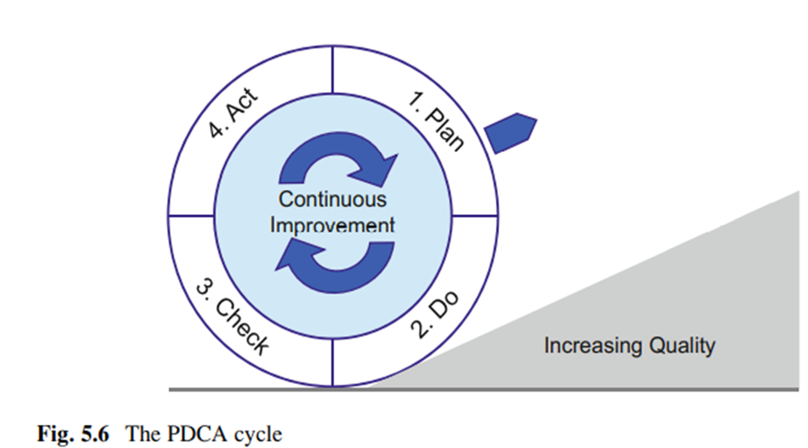

# Chapter 9

_**Section 1:**_

**9.1 This time the budget was approved – An introductory mini case:**

👩‍💼 Mary Janus, the head of the SQA team, faces rejection of her investment plan for the Java Solver package three times.

🧾 The package promises a 92% automatic detection rate of Java program errors and an 85% automatic correction rate, with trial results supporting its effectiveness.

💼 Mary decides to convince the GM by presenting calculations of the contribution margin of the proposed investment.

👥 She identifies various factors, such as the number of Java programmers and testers, the cost of employees, Java Solver licenses, training costs, and the expected changes in the team structure.

💰 She calculates estimated expenses and savings, showing potential annual savings of $7,000 for the first year and $43,000 for subsequent years.

📝 Mary submits this economic proposal to the GM, who approves it immediately and requests a future proposal focused on prevention cost.

🔬 The case highlights the growing importance of economic evaluation in quality assurance systems and the need to demonstrate potential profitability for investment proposals.

_**Section 2:**_

**9.2 Objectives of Cost of Software Quality Measurement:**

📊 Cost of software quality metrics helps in achieving economic control over SQA activities and outcomes.

🎯 Specific objectives include:

* Controlling costs to prevent and detect software errors.
* Evaluating financial damages from software failures to adjust the SQA budget.
* Assessing plans for SQA activity changes or investments in infrastructure.

<figure><figcaption></figcaption></figure>

🔍 Managerial control over CoSQ involves comparing actual performance with budgets, previous failure costs, previous project quality costs, and costs from other departments.

📈 Key CoSQ indicators:

* Percentage of CoSQ out of total software development cost.
* Percentage of software failure cost out of total development cost.
* Percentage of CoSQ out of total software maintenance cost.
* Percentage of CoSQ out of total software product sales and maintenance.

💰 CoSQ is a unique software quality metric using financial values for measurement. It provides a comprehensive overview of SQA activities, unlike other metrics.

👨‍💼 CoSQ highlights the importance of SQA by potentially reducing costs and improving financial performance.

📚 While cost of software development is well-studied, cost of software quality publications are relatively rare, emphasizing its importance.

📈 Quality cost data is crucial for process improvement and is discussed in IEEE Std. 730-2014.

_**Section 3:**_

**9.3 The Classic Model of Cost of Software Quality:**

🏭 The classic quality cost model was developed in the 1950s for manufacturing but was adapted for the software industry as the Cost of Software Quality (CoSQ) model.

📊 The CoSQ model categorizes quality costs into two general classes:

1. **Costs of Control:**
   * Prevention Costs: Invested in quality infrastructure and activities to reduce software errors, applicable across the organization.
   * Appraisal Costs: Spent on specific projects or systems to detect software errors.
2. **Costs of Failure of Control:**
   * Internal Failure Costs: Incurred in correcting errors detected during development through reviews, tests, or acceptance tests.
   * External Failure Costs: Expenses for correcting errors detected by customers or maintenance teams after software installation.

🛠️ **Prevention Costs**:

* Investments in quality infrastructure development or updates.
* Regular activities for quality operation.
* Employee training and certification.
* Internal and external quality audits.

🔍 **Appraisal Costs**:

* Formal and peer reviews.
* Software testing (unit, integration, system, acceptance).
* Quality assurance of work performed by external participants.

🔧 **Internal Failure Costs**:

* Cost of redesign or reprogramming.
* Costs of correcting programs.
* Repeated design reviews and retesting.
* Domino effect damages from project delays.

🚫 **External Failure Costs (Overt)**:

* Resolving customer complaints during the warranty period.
* Correcting software bugs during regular operation.
* Damages to customers due to severe software failures.
* Reimbursements for customer purchase costs.
* Insurance against customer claims.
* Domino effect external failure costs, including delay penalties and low-quality damages.

🤐 **Hidden External Failure Costs**:

* Damages from reduced sales and damaged reputation.
* Increased investment in sales promotions.
* Diminished prospects in tender competitions.
* Underpricing proposals to counter reputation damage.

| Cost Type                         | Description                                                                          | Examples                                                                                  |
| --------------------------------- | ------------------------------------------------------------------------------------ | ----------------------------------------------------------------------------------------- |
| **Costs of Control**              | Costs associated with efforts to prevent and reduce errors before they occur.        | Prevention Costs: Establishing quality infrastructure, employee training, quality audits. |
| **Prevention Costs**              | Investments aimed at avoiding errors systemically and across the organization.       | Developing quality procedures, employee training, quality audits.                         |
| **Appraisal Costs**               | Costs incurred to detect errors through inspections, reviews, and testing.           | Formal design reviews, peer inspections, software testing.                                |
| **Costs of Failure of Control**   | Costs incurred due to failures in prevention efforts.                                | Internal Failure Costs: Expenses to correct errors found during development.              |
| **Internal Failure Costs**        | Costs associated with correcting errors detected internally before software release. | Rework due to design or coding errors, retesting after corrections.                       |
| **External Failure Costs**        | Costs incurred after software is in production and errors are discovered externally. | Resolving customer complaints, correcting software bugs in the field.                     |
| **Hidden External Failure Costs** | Indirect costs arising from damaged reputation and reduced sales.                    | Loss of sales revenue, increased marketing expenses to rebuild reputation.                |

_**Section 3:**_

The scope of the Cost of Software Quality (CoSQ) as a part of overall software product costs is a crucial metric for management when considering investments in software quality. Various studies have examined the correlation between an organization's Software Quality Assurance (SQA) level and the proportion of CoSQ within the total development costs. Here are some key findings from these studies:

**Table 9.1: CoSQ According to CMM Levels**

<figure><figcaption></figcaption></figure>

* CMM Level 1: CoSQ is 60% of total software product costs, with prevention costs accounting for 2%, appraisal costs for 4%, internal failure costs for 22%, and external failure costs for 32%.
* CMM Level 2: CoSQ is 57% of total software product costs, with prevention costs accounting for 2%, appraisal costs for 10%, internal failure costs for 25%, and external failure costs for 20%.
* CMM Level 3: CoSQ is 51% of total software product costs, with prevention costs accounting for 4%, appraisal costs for 12%, internal failure costs for 25%, and external failure costs for 10%.
* CMM Level 4: CoSQ is 36% of total software product costs, with prevention costs accounting for 7%, appraisal costs for 11%, internal failure costs for 15%, and external failure costs for 3%.
* CMM Level 5: CoSQ is 21% of total software product costs, with prevention costs accounting for 12%, appraisal costs for 4%, internal failure costs for 5%, and external failure costs for 2%.

These results indicate that organizations with higher SQA levels tend to have a lower proportion of CoSQ as a percentage of total development costs.

**Table 9.2: CoSQ for American and European Projects (Averages)**

<figure><figcaption></figcaption></figure>

* American Software Development Projects: CoSQ averages 57.5% of total software product costs, with prevention costs accounting for 13.5%, appraisal costs for 16%, and internal and external failure costs for 28%.
* European Software Development Projects: CoSQ averages 67.7% of total software product costs, with prevention costs accounting for 8.7%, appraisal costs for 26.3%, and internal and external failure costs for 32.7%.

These findings highlight regional variations in CoSQ among American and European software development projects, with European projects generally having a higher CoSQ as a percentage of total costs.

These studies emphasize the importance of considering CoSQ as a significant component of software development and the potential benefits of improving software quality and SQA practices to reduce CoSQ as a percentage of total costs.

_**Section 4:**_

**Extended Model for Cost of Software Quality**:

| Cost Type                                           | Description                                                                                                               |
| --------------------------------------------------- | ------------------------------------------------------------------------------------------------------------------------- |
| **Quality Costs of Development and SQA Activities** | Costs associated with development and SQA efforts as defined by the classic CoSQ model.                                   |
| **Management Quality Costs**                        | Costs associated with managerial actions and decisions impacting software quality.                                        |
| **Management Control Costs**                        | Costs controlled by management for preventing and controlling failures.                                                   |
| **Managerial Prevention Costs**                     | Costs for managerial actions to prevent or reduce the likelihood of failures.                                             |
| **Managerial Appraisal Costs**                      | Costs for managerial actions to control the performance of specific projects.                                             |
| **Management Failure of Control Costs**             | Costs resulting from managerial failures in prevention and control activities.                                            |
| **Managerial Internal Failure Costs**               | Costs incurred throughout development due to managerial failures, affecting project resources and schedule.               |
| **Managerial External Failure Costs**               | Costs incurred after project completion due to managerial failures, affecting project delivery and customer satisfaction. |

<figure><figcaption></figcaption></figure>

This extended model incorporates managerial costs, which are specific to the software industry, and includes both prevention and appraisal activities carried out by management. It also addresses the impact of managerial decisions on project outcomes, including both internal and external failure costs.

_**Section 6:**_

<figure><figcaption></figcaption></figure>

To successfully apply a cost of software quality (CoSQ) system in an organization, several steps need to be followed:

**1. Definition of the Organization's CoSQ Items**:

* Choose between the classic or extended CoSQ model.
* Identify specific cost items relevant to the organization's activities, departments, teams, or projects.
* Classify these cost items into the appropriate subclasses of the chosen CoSQ model.

**2. Planning the Method for Cost Data Collection**:

* Decide whether to develop an independent data collection system or utilize the existing management information system (MIS).
* If using MIS, make necessary adaptations to record quality-related data.
* Ensure ease of regular reporting and data collection while minimizing potential biased reporting.

**3. Implementation of the Planned CoSQ System**:

* Assign responsibility for reporting and collecting quality cost data.
* Train the team in the logic and procedures of the new system.
* Provide support to address implementation issues and ensure regular reporting.
* Process collected CoSQ data, including classification, recording, and verification.
* Continuously update and revise cost item definitions and reporting methods based on feedback.

<figure><figcaption></figcaption></figure>

**4. Actions Taken in Response to Findings**:

* Analyze CoSQ reports by comparing them with previous periods and other relevant data.
* Apply the cost of software quality balance concept to assess the relationship between control costs and failure of control costs.
* Focus on achieving the optimal software quality level that minimizes total quality costs.
* Make decisions related to budgeting annual SQA activity plans and project budgets based on CoSQ analysis.
* Consider additional actions initiated by the Corrective Action Board (CAB) based on quality metrics and CoSQ data.

Table 9.4 provides examples of typical decisions and their expected results based on CoSQ analysis.

<figure><figcaption></figcaption></figure>

The implementation of a CoSQ system is a continuous process that involves data collection, analysis, and decision-making to improve software quality and cost-effectiveness. Regular reviews and adjustments to the system are essential for its effectiveness.

_**Summary**_&#x20;

1. 🎯 Objectives of CoSQ Measurements:
   * Control costs related to error prevention and detection.
   * Evaluate financial damages from software failures.
   * Facilitate budget revisions and updates for SQA activities.
2. 🔄 Comparison of Classic vs. Extended Model:
   * Classic model: Control costs and failure of control costs.
   * Extended model: Adds management quality costs.
3. 🧐 Justification for Extended CoSQ Model:
   * Software industry's unique characteristics justify including managerial quality costs.
   * Errors in management decisions can lead to significant losses.
4. ⚙️ Implementation of CoSQ System:
   * Define the CoSQ model and specific cost items.
   * Plan cost data collection method.
   * Implement the system and follow-up.
   * Take action based on findings.
5. 🤯 Problems in Implementing CoSQ System:
   * General problems: Inaccurate and incomplete data, biased reporting.
   * Unique software industry problems: Segmented activities, senior staff reporting issues, difficulties in determining responsibility for schedule failures, late compensation payments.

_**Review Questions:**_

🔍 9.1a. Explanation of Each CoSQ Subclass:

🛡️ Prevention Costs: These are proactive expenses aimed at preventing errors. Examples include training and code reviews.

🕵️ Appraisal Costs: These involve detecting errors once they occur, like testing and inspections.

🩺 Internal Failure Costs: Incurred when errors are found internally, before reaching customers. Examples: rework and retesting.

👨‍👩‍👦‍👦 External Failure Costs: These arise when customers identify defects, leading to support and warranty costs.

📋 9.1b. Suggested Items for Each CoSQ Subclass:

Prevention Costs:

1. 🎓 Training programs for software developers.
2. 🔄 Quality management system implementation.
3. 🚀 Code review tools and processes.

Appraisal Costs:

1. 🧪 Software testing activities.
2. 🔍 Code inspections and reviews.
3. 📝 Quality audits.

Internal Failure Costs:

1. 🧰 Rework to fix defects during development.
2. 💼 Costs for retesting after fixing defects.
3. 🕰️ Time spent diagnosing and addressing internal issues.

External Failure Costs:

1. 📞 Customer support for addressing software issues.
2. 📦 Warranty claims and replacements.
3. ⚖️ Legal fees for addressing customer complaints.

📊 9.2a. Nature of Each Class:

🎛️ Costs of Control: Prevention and appraisal costs within the organization's control to minimize defects.

💥 Costs of Failure of Control: Internal and external failure costs incurred when control measures fail.

💼 9.2b. Guiding Principle and Managerial Aspects:

Guiding Principle: Distinguish between proactive (control) and reactive (failure of control) measures in managing software quality.

🤝 Managerial Aspects:

* Resource allocation between prevention/appraisal.
* Cost-benefit analysis for quality investments.
* Continuous improvement of prevention/appraisal processes.

🔄 9.3a. Difference Between Classic and Extended Models:

Classic Model: Focuses on development-related quality costs. Extended Model: Adds management quality costs, recognizing managerial impact on project success/failure.

🧐 9.3b. Justification for Extended Model in Software:

Unique Characteristics of Software: Software development complexity and managerial impact. Managerial Errors: Errors in planning, staffing, and scheduling can lead to significant losses. High Preparation and Control Efforts: Software projects require extensive preparation and control. Unique Contracts: Software contracts differ from manufacturing, requiring different management control levels.

🧐9.4 The annual report issued by Leonard Software Inc. includes several expenditure items, listed in the table below. Indicate the subclass of cost of software quality to which each of the following expenditures belongs: PC = prevention costs, AC = appraisal costs, IFC = internal failure costs, EFC = external failure costs, MPC = management prevention costs, MAC = management appraisal costs, IMFC = internal management failure costs, and EMFC = external management failure costs. In cases where an expenditure item is not a software quality cost, mark “X” in the “nonsoftware quality cost” column.

<table><thead><tr><th>No.</th><th data-hidden>Expenditure Item</th><th data-hidden>Subclass of Software Quality Cost</th><th data-hidden>Non-Software Quality Cost</th></tr></thead><tbody><tr><td>1</td><td>Working hours spent installing software at customer’s site in Singapore</td><td>EFC</td><td></td></tr><tr><td>2</td><td>Waiving of customer’s debt as agreed to in compromise following software failures detected in the installed software</td><td>EFC</td><td></td></tr><tr><td>3</td><td>Payment for Dr. Jacobs’s participation in a design review</td><td>AC</td><td></td></tr><tr><td>4</td><td>Payments made to “King SQA Consultants” for preparing the new version of the software quality procedures</td><td>MPC</td><td></td></tr><tr><td>5</td><td>Repair of a color printer</td><td>X</td><td>X</td></tr><tr><td>6</td><td>Working hours spent participating in monthly meetings of the Coordination and Control Committee headed by the Department Manager</td><td>MPC</td><td></td></tr><tr><td>7</td><td>Travel to Switzerland to examine advanced software testing system proposed to the company</td><td>MPC</td><td></td></tr><tr><td>8</td><td>Purchase of barcode sticker software package to be integrated in the inventory management software system</td><td>PC</td><td></td></tr><tr><td>9</td><td>Working hours spent correcting errors listed in a design review report</td><td>IFC</td><td></td></tr><tr><td>10</td><td>Customer’s compensation for delay in schedule resulting from the company’s inability to recruit sufficient professional manpower for the development team</td><td>EFC</td><td></td></tr><tr><td>11</td><td>Working hours spent by the Chief Software Engineer and Martin Fountain, Senior Project Manager, in examining the schedule estimates for the “Top Assets” tender</td><td>MPC</td><td></td></tr><tr><td>12</td><td>Working hours spent in preparation of an updated version of Leonard Software’s C Programming Instructions</td><td>PC</td><td></td></tr><tr><td>13</td><td>Working hours spent by programmer (John) in correcting program bugs detected by his team leader in their weekly meeting</td><td>IFC</td><td></td></tr></tbody></table>

9.5 .png>)

a. Financial Examination of the Proposal:

To examine the proposal from a financial perspective, we need to calculate the expected impact on costs. Here are the calculations:

Expected Reduction in Failure Costs:

1. Internal Failure Costs Reduction: 10% of $4,238,000 = $423,800
2. External Failure Costs Reduction: 25% of $2,890,000 = $722,500
3. Managerial Internal and External Failure Costs Reduction: At least 25% of ($1,840,000 + $4,650,000) = At least $1,372,500

Total Reduction in Failure Costs = $423,800 + $722,500 + $1,372,500 = $2,518,800

Additional Expenditures:

1. Prevention Costs Increase: $400,000
2. Appraisal Costs Increase: $700,000
3. Managerial Prevention Costs Increase: $580,000
4. Management Appraisal Costs Increase: $220,000

Total Additional Expenditures = $400,000 + $700,000 + $580,000 + $220,000 = $1,900,000

Net Financial Impact:

Net Financial Impact = Total Reduction in Failure Costs - Total Additional Expenditures Net Financial Impact = $2,518,800 - $1,900,000 = $618,800 (Expected cost savings)

b. Utilization of Additional Funds:

To achieve the expected reduction in failure costs, the additional funds should be utilized effectively:

Invest in Comprehensive Testing: Allocate resources to comprehensive testing processes to detect and fix defects early in the development cycle.

Improve Quality Assurance: Strengthen quality assurance practices to ensure that software products meet quality standards.

Enhance Code Reviews: Invest in code reviews and inspections to identify and address issues before they become costly failures.

Implement Robust Project Management: Utilize the additional managerial resources to implement robust project management practices, reducing the risk of schedule overruns and associated failure costs.

c. Hidden Costs of Failure:

Hidden costs of failure that may be reduced as a result of implementing the proposal could include:

Lost Business Opportunities: Reduced reputation damage may lead to increased customer trust and additional business opportunities.

Legal Costs: Fewer customer complaints and disputes may lead to reduced legal expenses.

Employee Morale: Improved project outcomes can lead to higher employee morale and lower turnover rates.

Customer Satisfaction: Enhanced software quality can lead to higher customer satisfaction and retention.

d. Impact on CoSQ Percentage:

To determine the impact on the percentage of CoSQ in the total costs of software products, we need to consider the change in CoSQ and the total costs of software products.

Assuming the total development costs for next year are similar to the previous year ($12,876,000), we can calculate the new CoSQ percentage:

Previous CoSQ Percentage = (Total CoSQ / Total Development Costs) \* 100

Previous CoSQ Percentage = (($1,238,000 + $3,450,000 + $4,238,000 + $2,890,000 + $225,000 + $127,000 + $1,840,000 + $4,650,000) / $12,876,000) \* 100

Now, let's calculate the new CoSQ after the proposed changes:

New CoSQ = Total CoSQ - Total Reduction in Failure Costs New CoSQ = ($1,238,000 + $3,450,000 + $4,238,000 + $2,890,000 + $225,000 + $127,000 + $1,840,000 + $4,650,000) - $2,518,800

New CoSQ Percentage = (New CoSQ / Total Development Costs) \* 100

New CoSQ Percentage = (($1,238,000 + $3,450,000 + $4,238,000 + $2,890,000 + $225,000 + $127,000 + $1,840,000 + $4,650,000 - $2,518,800) / $12,876,000) \* 100

Calculate the New CoSQ Percentage to find out if the proposed project will reduce the percentage of CoSQ in the total costs of software products.

