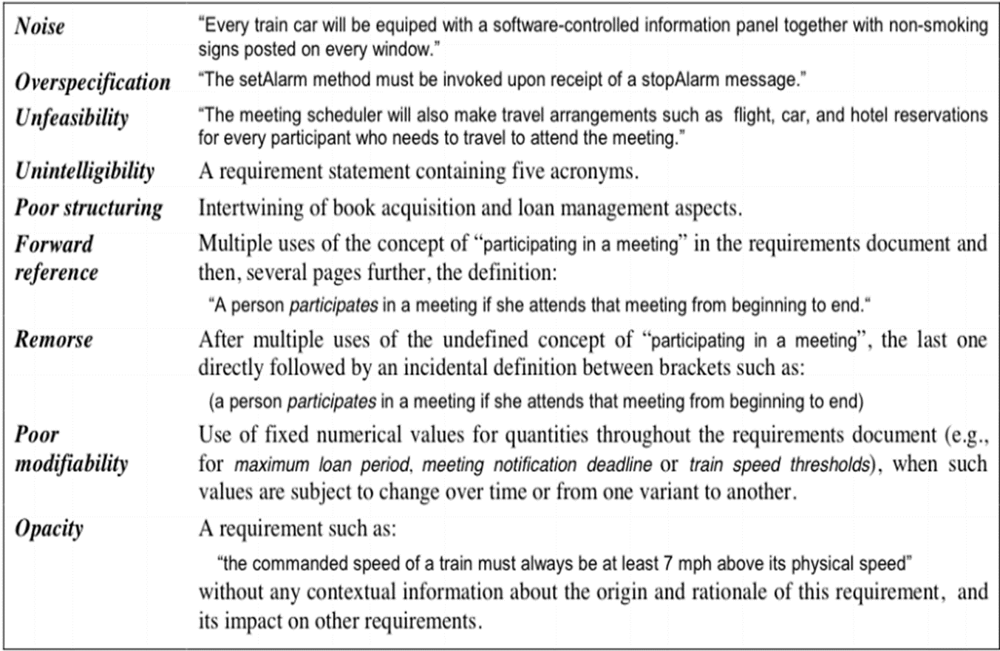

# Requirement and SQA

**Topics 📌**

1. **Quality in Requirements Specification** ✅
2. **Defects in Requirements Specification** 🐞
3. **Writing Quality Requirements** 📝

***

#### What is a Requirement? 🤔

* **Definition**: A measurable set of user needs and wants for a project or application.
* **Importance**: It is a necessary condition for system development.
* **Evaluation**: Systems are assessed based on how well they meet these requirements.
* **Requirement Types**:
  * Business or Functional 🏢
  * User Interface and Usability (Functional) 👥
  * Hardware (Functional) 🖥️
  * Software (Functional) 💾
  * Performance (Non-Functional) 🚀
  * Security (Non-Functional) 🔒

***

#### Why is Developing Software Hard? 💭

* **Challenge**: Determining what to build is the most difficult aspect.
* **Quote by Frederick Brooks**: Highlighting the complexity of establishing detailed technical requirements.

***

#### Requirement Pitfalls ⚠️

* Common Mistakes:
  * Misunderstanding user statements 🗣️
  * Confusing customers with users 🔄
  * Weak communication between users and developers 🤝
  * Lack of change management processes 🔄
  * Developers filling in the gaps without guidance 🛠️
  * Rushing through the requirements phase 🏃‍♂️

***

#### Why Can't We Get Requirements Right? ❓

* **Challenges**:
  * Distinguishing between stated and real requirements.
  * Ambiguity and validation issues.
  * Transfer of domain expertise.
  * Sourcing from incorrect places.
  * Users' uncertainty about their needs.
  * Managing changes effectively.
  * Commitment from all parties for project success.

***

#### Obstacle to Successful Business Solution Delivery: Business-IT Gap 🔗

* **Statistics**: 7 out of 10 projects fail due to early-stage problems.
* **Bridging the Gap**: Ensuring accurate translation from customer needs to business requirements and software capabilities.

#### Project Success Factors (Chaos report) 🏆

**Key Factors and Their Impact Percentages 🔍**

1. **User Involvement**: 15.9% 👥
2. **Executive Management Support**: 3.9% 🤝
3. **Clear Statement of Requirements**: 13.0% 📋
4. **Proper Planning**: 9.6% 📅
5. **Realistic Expectations**: 8.2% 🎯
6. **Smaller Project Milestones**: 7.7% 🚧
7. **Competent Staff**: 7.2% 💼
8. **Ownership**: 5.3% 🛠️
9. **Clear Vision & Objectives**: 2.9% 🌟
10. **Hard-Working, Focused Staff**: 2.4% 💪
11. **Other**: 23.9% ➕

***

#### Quality Requirements ✨

**Essential Characteristics 📚**

* **Correct**: Determined by user representative.
* **Feasible**: Aligned with technical and cost constraints.
* **Necessary**: Traced back to its origin.
* **Unambiguous**: Single interpretation.
* **Verifiable**: Proof of proper implementation.
* **Prioritized**: Based on customer value.

**Source: "Writing Quality Requirements" by Karl Wiegers**

***

#### Writing Example #1 🖋️

**Original Requirement 📝**

* "The product shall provide status messages at regular intervals not less than every 60 seconds."

**Critique 🔍**

* **Incomplete**: Missing details on status messages and display method.
* **Ambiguous**: Unclear product part and interval definition.
* **Not Verifiable**: Lack of specificity.

***

#### Alternative #1 🔄

**Refined Requirement ✅**

1. **Status Messages**:
   * Specific display intervals and conditions.
   * Clear and detailed descriptions of messages and error handling.

***

#### Validating Requirements (1/2 & 2/2) 🔎

**Key Questions for Validation 🤔**

* **Consistency with Objectives** 🎯
* **Level of Abstraction** 🧐
* **Necessity and Ambiguity** ❓
* **Attribution and Conflicts** 🆚
* **Technical Achievability** 🚀
* **Testability** 🧪
* **Reflection of System Model** 💡
* **Partitioning and Patterns** 🧩

#### What to Look Out For in Requirements (1/3) 🔍

**Watch Out For 🚨**

1. **Incomplete Lists**: Ending with "etc.", "and/or", "TBD" 📝
2. **Vague Words/Phrases**: Like "generally", "normally", "to the greatest extent" 🌫️
3. **Imprecise Verbs**: Such as "supported", "handled", "processed" 🔄
4. **Implied Certainty**: Words like "always", "never", "all", "every" 🚫
5. **Passive Voice**: E.g., "the counter is set" (by whom?) 💬
6. **Pronoun Clarity**: Ensure "it" or "its" have explicit references 👈

***

#### What to Look Out For in Requirements (2/3) 🔎

**Ambiguities and Interpretations 🤔**

* **Comparatives/Superlatives**: "earliest", "latest", "highest" 🔝
* **Subjective Terms**: Words with potential for misinterpretation between parties:
  * "Instantaneous", "Simultaneous", "Achievable" ⏱️
  * "Complete", "Finish", "Degraded" 🚧
  * "Minimum number of", "Nominal/normal/average" 📊
  * "Peak/minimum/steady state", "As required/specified/indicated" 📈
  * "Coincident/adjacent/synchronous with" ⏳

***

#### What to Look Out For in Requirements (3/3) 🧐

**Non-Quantifiable Measures 💭**

* **Abstract Concepts**: "Flexible", "Modular", "Efficient" 🌐
* **Qualitative Terms**: "Adequate", "Accomplish", "Possible" ✅
* **Relative Measures**: "Minimum required/acceptable/reasonable", "Better/higher/faster/less/slower/infrequent" 📏
* **Frequency/Vagueness**: "Some", "Worst", "Usually", "Often" 🔄
* **Extent Clauses**: "To the extent specified", "To be compatible/associated with" 📝

#### Verification vs. Validation of Requirements 🔍

**Verification of Requirements ✅**

* **Focus**: Working with raw requirements from stakeholders.
* **Key Question**: "Have we got the requirements right?"

**Validation of Requirements 🎯**

* **Focus**: Working with the final draft of the requirements document.
* **Key Question**: "Have we got the right requirements?"

***

#### The Problem with Requirements 🧩

* **Challenge**: Difficulty in measuring the quality of requirements leads to a lack of feedback.
* **Consequence**: Uncertainty about performance and when to stop.

***

#### Quality Requirements: Key Aspects 🌟

**1. Correctness 📏**

* **Identification**: Requires domain and context understanding.
* **Focus**: Complete, Clear, and Feasible requirements.

**1.1 Completeness ✔️**

* **Meaning**: Nothing is missing.
* **Tips**: Use Requirements Development tools or IEEE 830 format; Include incorrect information to prompt corrections.

**1.2 Clarity 📖**

* **Goal**: Avoid ambiguity.
* **Tips**: Get external reviews; Avoid duplicate information, use references or hypertext.

**1.3 Feasibility 🚀**

* **Reality Check**: Ensure project feasibility.
* **Tips**: Create working models or simulations; Label initial versions as 'Feasibility Models.'

***

#### 2. Compatibility 🔄

* **Definition**: Requirements must interrelate within the software development project.
* **Implies**: Verifiable, Traceable, Modifiable, Ranked for Importance.

**2.1 Verifiable ✅**

* **Standard**: Requirements must be testable.
* **Tip**: Create requirements that are actual system tests.

**2.2 Traceable 🔍**

* **Necessity**: Essential for Change Management.
* **Tip**: Number each requirement and maintain the numbering throughout development.

**2.3 Modifiable 🛠️**

* **Reality**: Requirements change frequently.
* **Tips**: Design in parts, use Incremental or Spiral development; Ensure success within every budget year.

**2.4 Ranked for Importance 🏆**

* **Prioritization**: Attach importance to each requirement.
* **Tip**: Focus on the most important subset of requirements first.

***

#### Other Things to Remember 📚

* **Tips**:
  * Avoid overloading the Requirements specification.
  * Use the specification to size the project effectively.
  * Be aware that similar alternatives can lead to debates.

\
Quality in the Analysis of Requirements 📊

***

#### Problem in Testing Requirements 💡

* **Question**: "How do you test your requirements?"
* **Solution**: Introduce a requirements analysis stage before coding starts.
* **QA Role**: Have QA check all requirements specifications and mockups for thoroughness.

***

#### Requirements Quality Assurance (QA) 🛠️

* **Goal**: Ensure items in the Requirements Document meet desired quality attributes like completeness, consistency, adequacy.
* **Importance**: High cost of requirements failures post-delivery.
* **Quote**: "Finding and fixing a software problem after delivery is often 100 times more expensive than during the requirements and design phase." \[Boehm and Basili]

***

#### Common Requirement Defects 🐞

* **Focus**: Identifying minor issues in requirements.

<figure><figcaption></figcaption></figure>

***

#### Making Requirements Measurable 📏

* **Strategy**: Define 'fit criteria' for each requirement.
* **Example**: ATM software - intuitive, self-explanatory, with specific success criteria.
* **Challenge**: Stakeholders often lack specificity; the right criteria might not be obvious.

***

#### Requirements Engineering and V\&V (Verification & Validation) 🔍

* Questions to Consider:
  * Have all requirements been elicited, understood, and specified?
  * Is there a consensus among all stakeholders?
  * Are there any remaining conflicts?
  * Are requirements specified correctly and in sufficient detail?

***

#### Cost of Requirements Errors 💸

* **Focus**: Understanding the financial implications of requirement errors.

<figure><figcaption></figcaption></figure>

***

#### When to Perform Requirements V\&V? ⏰

* **Throughout the Process**: Elicitation, Analysis, Specification.
* **Objectives**: Ensure defined system requirements meet user needs and conform to standards.

***

#### 6 Principles to Requirements Validation 🌟

1. **Involve Correct Stakeholders**
2. **Separate Error Identification from Correction**
3. **Validate from Different Perspectives**
4. **Use Alternative Formalisms**
5. **Build Development Items from Requirements**
6. **Repeat Validation Step (Continuous Validation)**

***

#### Requirements V\&V Techniques 🛠️

* **Prototyping**: Partial implementation for customer validation.
* **Inspections, Reviews, Walkthroughs**: Search for and recommend actions on defects.
* **Simulation**: Checks the appropriateness of specified behaviors.
* **Formal Checks**: Completeness, sanity checks, model checking, theorem proving.

\

#### Reviews and Inspections 📝

**Process Overview 🔍**

* **Objective**: Analyze requirements, identify potential problems, and devise action plans.
* **Effectiveness**: Supported by evidence and standardized (IEEE 1028).
* **Expense**: Requires careful planning, preparation, and pre-review checking.

**Types of Reviews 🎯**

* **Reading the Document**: Conducted by someone other than the author.
* **Reading and Approval (Sign-off)**: Encourages thorough review.
* **Walkthroughs**: Informal overviews, often led by the author or an expert.
* **Formal Inspections**: Structured, detailed review with defined participant roles.

***

#### Reviews Checklists ✅

**Importance of Checklists 🗂️**

* **Function**: Guide reviewers to focus on common problem areas.
* **Quality Aspects**: Comprehensibility, redundancy, completeness, ambiguity, consistency, organization, standards compliance, traceability.
* **Variety**: General and specific checklists for different modeling languages.
* **Development**: Need to be developed and maintained continuously.
* **Examples**: Simple (University of Ottawa link) and Complex (NASA ([NASA link](http://sw-ng.larc.nasa.gov/process/documents/pdfdocs/inspection.pdf)).

***

#### Elements of a Checklist 📊

**Key Checklist Components 🔑**

1. **Comprehensibility**: Understandability of the document.
2. **Redundancy**: Unnecessary repetition.
3. **Completeness**: Missing requirements or information.
4. **Ambiguity**: Clarity of terms used.
5. **Consistency**: Contradictions within requirements.
6. **Organization**: Logical structure and grouping of requirements.
7. **Conformance to Standards**: Adherence to defined standards.
8. **Traceability**: Clear identification and linkage of requirements.

#### Types of Software Requirements 📚

**Basic Requirement Types 🔄**

* **Functional Requirements**: Specific functions the system must perform. 💻
* **Non-Functional Requirements**: Quality attributes the system must exhibit. 🌟
* **Sources for Requirements**: When formal documents are not available:
  * Knowledge transfer from colleagues. 🗣️
  * Discussions with business analysts, product managers, project leads, developers. 💼
  * Analyzing previous system versions and older requirement documents. 🔍
  * Examining past bug reports and enhancements. 🐞
  * Reviewing installation guides for requirements. 📘
  * Domain or industry knowledge implementation. 🏭

**Business Requirements Example 🏦**

* **Country Specific**: Different banking functionalities for India (Account Summary, Fund Transfer) and China (Account Summary, Bill Payment).

***

#### Architectural and Design Requirements 🏗️

* **Detail Level**: More detailed than business requirements.
* **Implementation Focus**: Design required to implement business needs.
* **Example**:
  * Use Case: Net banking login and bill payment.
  * Features: Dashboard, bill management, alerts, bill history.
  * Actors: Bank customers, support personnel.

***

#### How to Analyze Requirements ğŸ”

<figure><figcaption></figcaption></figure>

**Educational Software Example 🎓**

* **System Function**: Student course registration.
* **Quality of Requirements**:
  * **Atomic**: Each requirement is indivisible. 🔢
  * **Uniquely Identified**: Every requirement has a unique identifier. 🔑
  * **Complete**: Requirements are fully described. ✔️
  * **Consistent and Unambiguous**: Clear and non-contradictory. 📖
  * **Traceable**: Easy to track back to sources. 🔗
  * **Prioritized**: Importance ranking assigned. 🏆
  * **Testable**: Can be empirically verified. 🧪.

#### How to Analyze Requirements ğŸ”

**Understanding through Examples 📊**

* **Columns in the Table**:
  * **First Column**: Requirement Quality 🌟
  * **Second Column**: Example of a Bad Requirement ❌
  * **Third Column**: Transformed into a Good Requirement ✅

**Examples of Requirement Transformation 🔄**

1. **Atomic** 💠
   * Bad: Students enroll in undergraduate and postgraduate courses.
   * Good: Separate enrollment for undergraduate and postgraduate courses.
2. **Uniquely Identified** 🔢
   * Bad: Overlapping enrollment requirements.
   * Good: Distinct requirements for undergraduate and postgraduate course enrollment.
3. **Complete** ✔️
   * Bad: Incomplete login information.
   * Good: Complete details for professor login.
4. **Consistent and Unambiguous** 🎯
   * Bad: Conflicting course availability.
   * Good: Clear distinction between undergraduate and postgraduate courses.
5. **Traceable** 🔗
   * Bad: Unclear mapping to Business Requirements Document (BRD).
   * Good: Clear mapping to specific BRD requirement ID.

***

#### How to Analyze Requirements (Continued) 🔍

6. **Prioritized** 🏆
   * Bad: Equal priority for different tasks.
   * Good: Distinct priority levels for registering students, maintaining user information, enrolling courses, and viewing report cards.
7. **Testable** 🧪
   * Bad: Vague loading time for system pages.
   * Good: Specific loading time (within 5 seconds) for registering students and enrolling courses pages.

<figure><figcaption></figcaption></figure>

<figure><figcaption></figcaption></figure>
