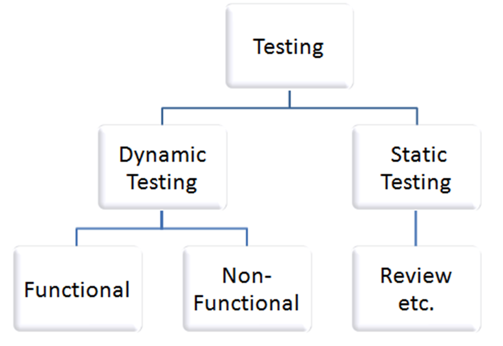

# Static Test

#### 📊 **Static Tests** 📊

* **What is it?** 🤔
  * Under Static Testing, code is **not executed**. It manually checks the code, requirement documents, and design documents to find errors. Hence, the name "static" 🚫🖥️.
* **Main Objective** 🎯
  * To improve the quality of software products by finding errors in the **early stages** of the development cycle. This testing is also called as Non-execution technique or verification testing 🔍🛠️.

#### 📑 **Documents Reviewed in Static Testing** 📑

* Requirement specifications 📄
* Design document 🎨
* Source Code 💻
* Test Plans 📋
* Test Cases ✔️
* Test Scripts 📝
* Help or User document 📘
* Web Page content 🌐

#### 🕵️ **Types of Static Tests** 🕵️

1. **Review (Manual Examination)** - A systematic examination of a document by one or more people with the main aim of finding and removing errors early in the SDLC 🧐.
2. **Static analysis (Automated Analysis)** - Tools typically used by developers, e.g., compilers, to analyze without executing the code 🤖.

#### 🔄 **Dynamic Testing** 🔄

* **What's Different?** 🤷‍♂️
  * Under Dynamic Testing, code is executed. It checks for functional behavior, memory/CPU usage, and overall performance of the system. Hence the name "Dynamic" ✅🖥️.
* **Main Objective** 🎯
* To confirm that the software product works in conformance with the business requirements. This testing is also called as Execution technique or validation testing 🔧🔍.

#### 🛠️ **Dynamic Techniques Types** 🛠️

1. **Specification Based or Black Box Techniques** (Focuses on external functionality)
   * Equivalence Partitioning
   * Boundary Value Analysis
   * Decision Table Testing
   * State Transition Testing
   * Use Case Testing
2. **Structured Based or White Box Techniques**
   * Statement Testing and Coverage
   * Decision Testing and Coverage
   * Condition Testing, Multi condition Testing, etc.
3. **Experienced Based Testing (Informal)**
   * Error Guessing
   * Exploratory Testing

#### ⚖️ **Static Vs Dynamic Testing** ⚖️

* **Static Testing**: Done without executing the program, focuses on prevention of defects, and involves a checklist and process to be followed 🚫.
* **Dynamic Testing**: Done by executing the program, focuses on finding and fixing defects, involves test cases for execution ✅.

<figure><figcaption></figcaption></figure>

<figure><figcaption></figcaption></figure>

#### 📝 **Structured Group Evaluations** 📝

* **Foundation**: Use human ability to think and analyze, intensive reading, and understanding of the examined documents 🧠.
* **Reviews**: Analyze a software work product and recommend changes to improve quality 👥.

#### 🎯 **Types of Reviews** 🎯

* **Walkthroughs**: Informal, led by authors to gather feedback 🚶‍♂️.
* **Technical Review**: Less formal, led by trained moderator, focuses on document content

🛠️.

* **Inspection**: Most formal, involves thorough preparation and a follow-up, led by trained moderators with entry and exit criteria 🔎.

#### 🔄 **The General Process of Reviews** 🔄

1. **Planning**: Decide which documents to review and prepare materials 📅.
2. **Kick-Off**: Provide necessary information to review participants 🚀.
3. **Individual Preparation**: Participants prepare by reviewing the item and noting questions or possible defects 🧐.
4. **Review Meeting**: Led by a review leader, where diplomatic discussion and evaluation occur 👨‍🏫.
5. **Rework and Follow-Up**: Addressing and correcting defects found during the review 🛠️.

#### 📌 **Roles and Responsibilities** 📌

* **Manager**: Selects objects for review and assigns resources 👨‍💼.
* **Moderator**: Responsible for executing the review and collecting data 🧑‍🔬.
* **Author**: Creates the document and ensures it meets review criteria 📝.
* **Reviewer**: Identifies and describes problems, representing different viewpoints 👀.
* **Recorder**: Documents issues found during the review 📓.

***

#### 🤔 Tricky Questions on Static Testing

1. **Why is static testing considered a non-execution technique?** 🚫💻
2. **How can static analysis differ from manual review in terms of effectiveness for finding specific types of errors?** 🤖 vs. 🧐
3. **What are the main advantages of conducting walkthroughs during the static testing process?** 🚶‍♂️💡
4. **In what scenarios might a technical review be preferred over an inspection?** 🛠️🔍
5. **How does the role of a recorder contribute to the overall effectiveness of the review process?** 📓🎯
