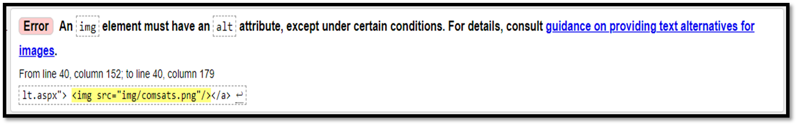

# Lecture 3

📜 **HTML History** 🗂️ HTML History Timeline:

1. 🔧 HTML stands for Hypertext Markup Language.
2. 🖋️ HTML is a markup language.
3. 📄 A markup language consists of markup tags.
4. 📝 Tags describe document content or layout.
5. 📂 HTML documents contain HTML tags and plain text.
6. 🌐 First mentioned on the Internet by Tim Berners-Lee in late 1991.
7. 📅 HTML 2.0 was published in Nov 1995.
8. 📅 HTML 3.2 was published in Jan 1997.
9. 📅 HTML 4.0 was published in Dec 1997.
10. 📅 HTML 5.0 was published in Oct 2014.

🖥️ **HTML and XHTML** 🌐 HTML ➡️ Content structure and meaning. 🔑 Important Key Points:

* 🔖 `<!DOCTYPE html>`, `<html>`, `<head>`, `<title>`, and `<body>` are mandatory.
* 🧩 Elements must always be properly nested. 📦 XHTML ➡️ More restrictive, follows XML standards.

📝 **HTML Elements** 🔢 HTML element structure:

* Syntax: `<tagname> content goes here </tagname>`
* Example: `
 this is a paragraph statement. 
`
* Example: `<a href="hib.html"> click here to view </a>` ➡️ Some tags don't contain information and can be opened and closed in one tag (singleton tags).
* Example: line break ` `, and horizontal line `
`

📊 **Block-Level Element vs Inline Element** 🧱 **Block-Level Element**

* Always starts on a new line, takes up full width.
* Examples: `
`, `
`, `<ol>`, `<ul>`, `<h1>` - `<h6>`, etc. 📏 **Inline Element**
* Doesn't start on a new line, takes up necessary width.
* Examples: `<b>`, `<strong>`, `<i>`, `<em>`, `<small>`, `<a>`, ``, etc.

📦 **HTML Page Structure**

* `<html>` ➡️ Root of an HTML document.
* 🌍 Include `lang` attribute to declare the language.
* Save HTML page as a `.html` file. 📄 **HTML Head Tag `<head>`**
* Container for `<title>`, `<style>`, `<meta>`, `<link>`, `<script>`.
* Placed between `<html>` and `<body>`. 📰 **HTML Title Tag `<title>`**
* Defines the document's title.
* Shown in the browser's title bar or tab.
* Provides a title for favorites and search engine results.

📃 **HTML Body Tag `<body>`**

* Defines the document's body.
* Contains all content, like headings, paragraphs, images, links, tables, lists.
* Only one `<body>` element in an HTML document. 📝 **HTML Paragraph Tag `
`**
* Defines a paragraph.
* Indicates the start and end of the paragraph.
* Browsers add blank lines before and after `
`.

📋 **HTML Heading Tags `<h1>` - `<h6>`**

* Defines headings.
* `<h1>` most important, `<h6>` least important.
* Use sequentially for a hierarchy.

🔗 **HTML Links Tag `<a>`** 🔗 HTML links are hyperlinks.

* `<a>` defines a hyperlink to link from one page to another.
* Example: `<a href="file.html">`
* `href` indicates the link's destination URL.
* Can be absolute or relative.

🖼️ **HTML Images Tag ``**

* Embeds an image.
* Required attributes: `src` (image source) and `alt` (alternate text).
* Image as a link example.

🎥 **HTML Video Tag `<video>`**

* Embeds video content.
* Attributes include `src`, `controls`, `height`, and `width`.

🔊 **HTML Audio Tag `<audio>`**

* Embeds audio content.
* Attributes include `src` and `controls`.

📝 **HTML Phrase Tags**

HTML phrase tags serve special purposes, adding emphasis, meaning, or styling to specific parts of your content. Here are some commonly used HTML phrase tags, along with examples and code:

1. **Abbreviation Tag - `<abbr>`** 🧐
   * `<abbr>` is used to define an abbreviation or acronym.
   * It's helpful for providing the full expansion of an abbreviation when needed.
   * Example: `
The <abbr title="World Wide Web">WWW</abbr> is a vast resource.
`
2. **Marked Tag - `<mark>`** 🖍️
   * `<mark>` highlights or marks a portion of text for emphasis.
   * Useful when you want to draw attention to specific words or phrases.
   * Example: `
Don't forget to bring your <mark>passport</mark> for the trip.
`
3. **Strong Tag - `<strong>`** 💪
   * `<strong>` indicates that the enclosed text is of strong importance or significance.
   * Typically displayed in bold for added emphasis.
   * Example: `
<strong>Important:</strong> Safety first!
`
4. **Emphasized Tag - `<em>`** 🎯
   * `<em>` emphasizes or italicizes text to give it emphasis.
   * Use it to highlight words or phrases with a different tone.
   * Example: `
<em>Well done</em>, you've achieved your goal!
`
5. **Quote Tag - `<q>`** 💬
   * `<q>` defines a short inline quotation, often enclosed in quotation marks.
   * It's useful for quoting short pieces of text within a paragraph.
   * Example: `
<q>To be or not to be, that is the question.</q>
`
6. **Code Tag - `<code>`** 💻
   * `<code>` is used to display computer code.
   * Text within this tag is typically displayed in a monospaced font.
   * Example: `
For adding a border in CSS, use <code>border: 1px solid #000;</code>.
`

📊 **W3C Validator** 🔍 Validates HTML tags against W3C standards. 🚫 Errors if formatting standards are not met.

<figure><figcaption></figcaption></figure>

<figure><figcaption></figcaption></figure>

<figure><figcaption></figcaption></figure>
