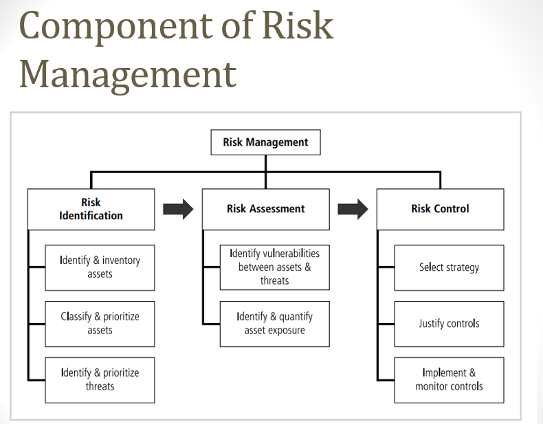

# Week 6

### 🛡️ **Risk Management** (Chapter 4: Principles of Information Security)

***

#### **📚 Learning Objectives**

1. Understand the fundamentals of **Risk Management**: _Risk Identification_, _Risk Assessment_, and _Risk Control_.
2. Explore **Asset Identification**, **Information Asset Valuation**, and **Vulnerability Identification**.
3. Study **Risk Control Strategies** and **Cost Benefit Analysis (CBA)**.

***

#### **🧩 Introduction to Risk Management**

**Risk Management** is identifying and mitigating risks to protect an organization's assets and maintain its **information security**. It involves three primary tasks:

1. **Risk Identification** 📋
2. **Risk Assessment** 📊
3. **Risk Control** 🛠️

> **Analogy**: Think of risk management as preparing for a storm 🌩️. First, you identify what’s at risk (windows, doors), assess their vulnerability, and then decide how to secure them.

***

#### **🕵️‍♂️ Risk Identification**

**Purpose**: To document and understand the security status of an organization’s IT and identify possible risks.

**Steps**:

1. **Identify Assets**: Know all information assets and their roles.
2. **Threat Assessment**: Identify threats to each asset.
3. **Classify Assets**: Organize assets by importance and vulnerability.

> **Example**: Think of assets as the **valuables** in your house 🏠—you’d classify them based on importance, like jewelry, electronics, or important documents.

***

#### **⚖️ Risk Assessment**

**Definition**: Determines the likelihood and impact of risks on each asset.

1. **Likelihood**: Probability that a vulnerability will be exploited (0.1 - low to 1.0 - high, per NIST guidelines).
   * _Example_: A network with many open connections may have a high likelihood of attacks.
2. **Risk Rating**: Calculate using values assigned to assets and vulnerabilities to determine **risk scores**.

<figure><figcaption></figcaption></figure>

***

#### **🔢 Risk Determination Formula**

For assessing risks, you may calculate **Relative Risk Factor (RRF)**:

1. **Asset Value**: Value assigned to an asset.
2. **Likelihood**: Probability of attack.
3. **Risk Determination**: Asset value x Likelihood.

> **Example**: If an asset is valued at 50 with a likelihood of 1.0, the risk score is 50.

***

<figure><figcaption></figcaption></figure>

#### **🛡️ Risk Control Strategies**

When risks are identified and assessed, the organization can choose one of the following strategies:

1. **Defend** 🛡️: Prevent exploitation by countering threats or adding safeguards.
   * **Methods**: Policy enforcement, employee training, and technology application.
2. **Transfer** 🔄: Shift risk to another entity (e.g., outsourcing, insurance).
   * _Example_: Organizations may outsource web hosting to a provider, transferring the risk of web security.
3. **Mitigate** 📉: Reduce the impact of risks via **incident response, disaster recovery, and business continuity plans**.
   * _Example_: Having a backup power system for servers to minimize downtime.
4. **Accept** 🤷: Acknowledge the risk without specific controls.
   * Conditions: Only acceptable if the risk level is low and mitigation is not cost-effective.
5. **Terminate** ❌: Avoid activities that introduce uncontrollable risks.

> **Analogy**: These strategies are like **different reactions to a storm**—defend (fortify), transfer (move valuables), mitigate (board up windows), accept (do nothing), or terminate (leave the area).

***

#### **💰 Cost Benefit Analysis (CBA)**

**Purpose**: To ensure that the cost of security measures does not exceed the value of the assets being protected.

1. **Single Loss Expectancy (SLE)**: Expected loss per attack.
   * Formula: **SLE = Asset Value x Exposure Factor (EF)**
2. **Annualized Loss Expectancy (ALE)**: Expected loss over a year.
   * Formula: **ALE = SLE x Annual Rate of Occurrence (ARO)**
3. **CBA Formula**:
   * **CBA = ALE (prior) - ALE (post) - Annualized Cost of Safeguard (ACS)**

> **Analogy**: Cost-benefit analysis is like **budgeting for home insurance** 🏡—you calculate if the coverage cost is justified by the value of your home and the risk of incidents.

***

#### **📝 Ongoing Evaluation of Risk Controls**

Risk controls are continuously assessed for effectiveness, and adjustments are made to manage **residual risk** (remaining risk after controls are applied).

***

### **📝 Exam Questions**

#### **Definitions and Descriptions**

1. **Define risk management and describe its components.**
2. **Explain the difference between risk assessment and risk control.**

#### **Calculations and Formulas**

1. **Calculate the SLE, ALE, and CBA using provided asset values and occurrence rates.**
2. **Explain the steps to calculate risk determination and relative risk factor.**

#### **Comparison and Analysis**

1. **Compare each risk control strategy and give examples of when each is appropriate.**
2. **Discuss when it is appropriate to use the “Accept” strategy in risk management.**

#### **Scenario-Based Applications**

1. **If a company faces a high risk of server attacks, which control strategy should they choose and why?**
2. **Describe a scenario where the Transfer strategy is the best approach.**
